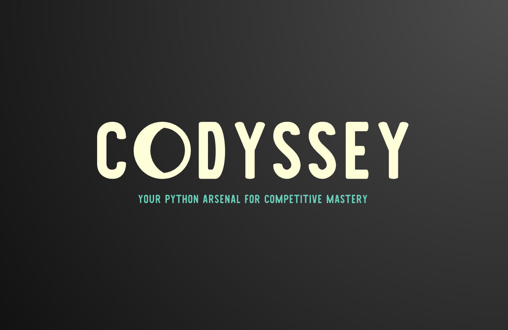

<!-- PROJECT SHIELDS -->
[![Contributors][contributors-shield]][contributors-url]
[![Forks][forks-shield]][forks-url]
[![Stargazers][stars-shield]][stars-url]
[![Issues][issues-shield]][issues-url]
[![MIT License][license-shield]][license-url]
[![LinkedIn][linkedin-shield]][linkedin-url]


<!-- PROJECT LOGO -->
<br />
<div align="center">
  <a href="https://github.com/varskann/Codyssey">
    
  
  </a>

  <h3 align="center">Codyssey</h3>

  <p align="center">
    Codyssey: Your Python arsenal for competitive mastery.
    <br />
    <a href="https://github.com/varskann/Codyssey"><strong>Explore the docs »</strong></a>
    <br />
    <br />
    <a href="https://github.com/varskann/Codyssey">View Demo</a>
    ·
    <a href="https://github.com/varskann/Codyssey/issues">Report Bug</a>
    ·
    <a href="https://github.com/varskann/Codyssey/issues">Request Feature</a>
  
  </p>

</div>

<!-- TABLE OF CONTENTS -->
<details>
  <summary>Table of Contents</summary>
  <ol>
    <li>
      <a href="#about-the-project">About The Project</a>
      <ul>
        <li><a href="#built-with">Built With</a></li>

      </ul>

    </li>
    <li>
      <a href="#getting-started">Getting Started</a>
      <ul>
        <li><a href="#prerequisites">Prerequisites</a></li>

        <li><a href="#installation">Installation</a></li>

      </ul>

    </li>

    <li><a href="#usage">Usage</a></li>
    <li><a href="#roadmap">Roadmap</a></li>
    <li><a href="#contributing">Contributing</a></li>
    <li><a href="#license">License</a></li>
    <li><a href="#contact">Contact</a></li>
    <li><a href="#acknowledgments">Acknowledgments</a></li>

  </ol>

</details>


<!-- ABOUT THE PROJECT -->
## About The Project

Embark on a journey to conquer the algorithmic wilderness and ascend the ranks of competitive coding heroes with Codyssey, your Python-powered resource for mastering data structures, algorithms, and competitive programming challenges.

<h3>What's inside?</h3>
 - **Pythonic Solutions:** LeetCode, NeetCode & beyond, conquered with crystal-clear Python.
 - **DSA Sharpening:** From novice to ninja, hone your data structures & algorithms. 
 - **Beyond the Platform:** CLRS & more, competitive coding mastery from all corners.
 - **Blog of Wisdom:** In-depth insights, strategies, and wisdom from coding veterans.

<h3>Why Codyssey?</h3>
 - **Clear and concise explanations:** Understand the "why" behind the code, not just the "how."
 - **Focus on Python:** Master the art of algorithmic problem-solving using your favorite language.
 - **Community of Coders:** Join a thriving, open-source, community of fellow adventurers on their quest for competitive mastery.
 - **Competitive Programming:** Learn from the best, and get inspired by the best.
 - **Continuous Growth:** The journey never ends. We constantly expand our resources and add new content to keep you challenged and engaged.


### Built With

Crystal-clear, concise, and powerful - your Python code conquers challenges like a Jedi Master's lightsaber.

[![Python][Python]][Python-url]


<!-- GETTING STARTED -->
## Getting Started

Explore the repository for solutions to a variety of coding challenges.
Dive into the blog series for in-depth explanations and insights.
Share your thoughts, questions, and progress in the discussion forum.

### Prerequisites


### Installation

_Below is an example of how you can instruct your audience on installing and setting up your app. This template doesn't rely on any external dependencies or services._

1. Clone the repo
   ```sh
   git clone https://github.com/varskan/Codyssey.git
   ```
2. Install Pip packages
   ```sh
   pip install codyssey
   ```

<!-- USAGE EXAMPLES -->
## Usage

Use this space to show useful examples of how a project can be used. Additional screenshots, code examples and demos work well in this space. You may also link to more resources.

_For more examples, please refer to the [Documentation](https://example.com)_

<p align="right">(<a href="#readme-top">back to top</a>)</p>


<!-- ROADMAP -->
## Roadmap

- [x] Add Changelog
- [x] Add back to top links
- [ ] Add Additional Templates w/ Examples
- [ ] Add "components" document to easily copy & paste sections of the readme
- [ ] Multi-language Support
    - [ ] Chinese
    - [ ] Spanish

See the [open issues](https://github.com/varskann/Codyssey/issues) for a full list of proposed features (and known issues).


<!-- CONTRIBUTING -->
## Contributing

Contributions are what make the open source community such an amazing place to learn, inspire, and create. Any contributions you make are **greatly appreciated**.

If you have a suggestion that would make this better, please fork the repo and create a pull request. You can also simply open an issue with the tag "enhancement".
Don't forget to give the project a star! Thanks again!

1. Fork the Project
2. Create your Feature Branch (`git checkout -b feature/AmazingFeature`)
3. Commit your Changes (`git commit -m 'Add some AmazingFeature'`)
4. Push to the Branch (`git push origin feature/AmazingFeature`)
5. Open a Pull Request


<!-- TODO -->
## TODO
- Setup Read the Docs Page
- Setup Github Pages
- Update ReadMe and detailed guidelines
- Link with Medium blogs
- Understand Changelog

<!-- LICENSE -->
## License

Distributed under the MIT License. See `LICENSE` for more information.


<!-- CONTACT -->
## Contact

[@varskann](https://twitter.com/your_username) - varskann1993@gmail.com

Project Link: [https://github.com/varskann/Codyssey](https://github.com/varskann/Codyssey)


<!-- ACKNOWLEDGMENTS -->
## Acknowledgments

Use this space to list resources you find helpful and would like to give credit to. I've included a few of my favorites to kick things off!

* [Choose an Open Source License](https://choosealicense.com)
* [GitHub Emoji Cheat Sheet](https://www.webpagefx.com/tools/emoji-cheat-sheet)
* [Malven's Flexbox Cheatsheet](https://flexbox.malven.co/)
* [Malven's Grid Cheatsheet](https://grid.malven.co/)
* [Img Shields](https://shields.io)
* [GitHub Pages](https://pages.github.com)
* [Font Awesome](https://fontawesome.com)
* [React Icons](https://react-icons.github.io/react-icons/search)


<!-- MARKDOWN LINKS & IMAGES -->
<!-- https://www.markdownguide.org/basic-syntax/#reference-style-links -->
[contributors-shield]: https://img.shields.io/github/contributors/varskann/Codyssey.svg?style=for-the-badge
[contributors-url]: https://github.com/varskann/Codyssey/graphs/contributors
[forks-shield]: https://img.shields.io/github/forks/varskann/Codyssey.svg?style=for-the-badge
[forks-url]: https://github.com/varskann/Codyssey/network/members
[stars-shield]: https://img.shields.io/github/stars/varskann/Codyssey.svg?style=for-the-badge
[stars-url]: https://github.com/varskann/Codyssey/stargazers
[issues-shield]: https://img.shields.io/github/issues/varskann/Codyssey.svg?style=for-the-badge
[issues-url]: https://github.com/varskann/Codyssey/issues
[license-shield]: https://img.shields.io/github/license/varskann/Codyssey.svg?style=for-the-badge
[license-url]: https://github.com/varskann/Codyssey/blob/master/LICENSE.txt
[linkedin-shield]: https://img.shields.io/badge/-LinkedIn-black.svg?style=for-the-badge&logo=linkedin&colorB=555
[linkedin-url]: https://linkedin.com/in/varskann
[Python]: https://img.shields.io/badge/Python-3776ab?style=for-the-badge&logo=Python&logoColor=yellow
[Python-url]: https://www.python.org/

